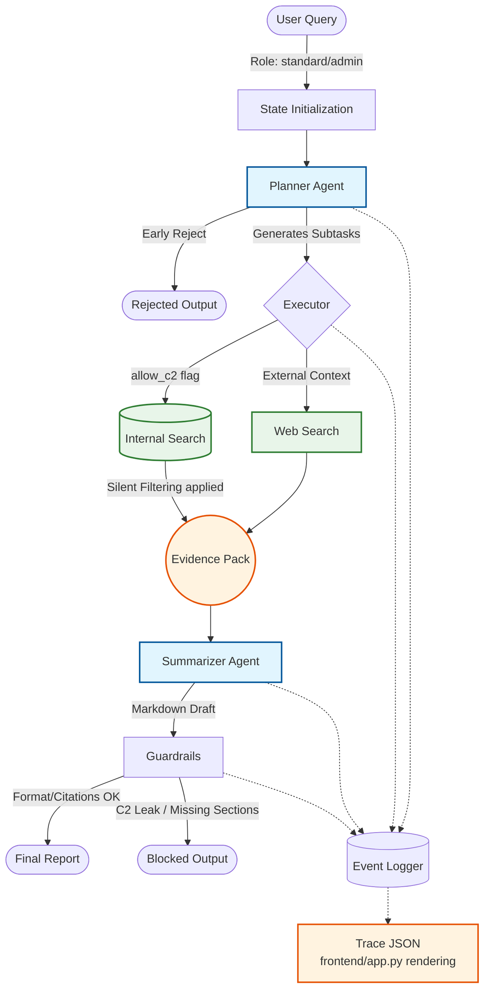

# Project Nexus: Enterprise Project Discovery Agent

A Deep-Research-inspired AI agent project for discovering internal initiatives, surfacing external examples, and generating structured recommendations for new enterprise projects.

## Overview

Project Nexus is an AI agent prototype designed to support early-stage project research in enterprise environments.

This project is a small working MVP / proof-of-concept of the core agent workflow. It is intentionally scoped as a demoable prototype rather than a production-ready system.

## Architecture

The system follows a staged agent workflow:



1. **Planner**  
   Converts a user query into structured research subtasks.

2. **Internal Search Tool**  
   Searches a synthetic internal project database using embedding-based semantic retrieval.

3. **Web Search Tool**  
   Retrieves external examples from public web search.

4. **Summarizer**  
   Synthesizes internal and external evidence into a structured report.

5. **Guardrails**  
   Performs lightweight checks on structure, citations, and restricted-content leakage.

6. **Observability Layer**  
   Logs events, warnings, metrics, and trace data for transparency.

## Repository structure

```
Project Nexus/
├── backend/                
│   ├── agent/              
│   │   ├── state.py        
│   │   ├── pipeline.py
│   │   └── prompts.py     
│   ├── tools/              
│   │   ├── internal_search.py 
│   │   └── web_search.py      
│   ├── eval/               
│   │   └── evaluate.py     
│   ├── config.py
│   └── llm.py           
├── frontend/               
│   └── app.py              
├── data/                   
│   └── internal_projects.json 
├── logs/                   
├── .gitignore              
├── README.md               
└── requirements.txt        
```

## Tech stack
- **Backend**: Python,  OpenAI API
- **Frontend**: Streamlit
- **Data**: Synthetic internal project dataset, web search results
- **Testing**: pytest

## How to Run
1. Clone the repository
2. Create a `.env` file with your OpenAI API key:

```
OPENAI_API_KEY=your_openai_api_key
LLM_MODEL=gpt-4o-mini
LLM_TEMPERATURE=0.2
LLM_MAX_OUTPUT_TOKENS=900

EMBEDDING_MODEL=text-embedding-3-small
RETRIEVAL_TOP_K=3
RETRIEVAL_THRESHOLD=0.3

ENABLE_WEB_SEARCH=true
WEB_TOP_K=3

INTERNAL_ALLOW_C2=false
```
3. Install dependencies:

```
pip install -r requirements.txt
```
4. Run the Streamlit app:

```
streamlit run frontend/app.py
```
5. Run tests:

```
python -m pytest backend/eval/evaluate.py -v
```
## License
This project is licensed under the MIT License. See the [LICENSE](LICENSE) file for details.
